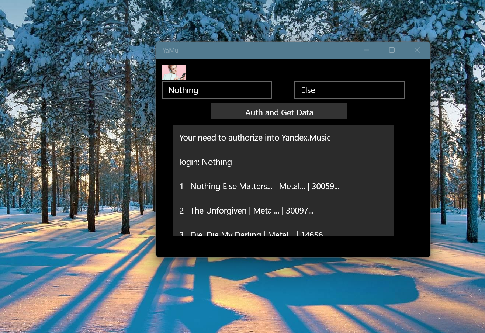

# Yamu - Yandex.Music UWP client (unoffical, sketch only / draft)

## Screenshots

## Abstract
Allows you to listen to music through Yandex integration in the simple uwp app

Original status: lost (obsolete)

## My actions (my 2 cents) 

1. Lite bugfix (some try...catch added to avoid accident app halts...)

2. Simple "GUI" mode to get 10 popular music tracks by Artist ID (Metallica)

## Description

Sorry, this is not full player... It's only draft UWP mini-app based on PC version of Win SDK (not suitible for W10M) 

Idk how to port this code onto .NET Standard 1.4 :(

Note: This project was created as a proof-of-concept over a short amount of time. 
The code may not be perfect. It exists for demonstration and educational purposes. Feel free to fork this project!

## Coding "workbench"

1. Visual Studio 2022

2. .NET Core 3.1

## Test scenario

Compile

Start app

Fill your Login and Pass to "full authorize" on Yandex.Music service (or skip this phase , because of 
non-auth mode is also good too for getting some song info...)

Press the button "Auht and Get Data"

Test the result that must be 10 popular music tracks of Metallica =)
 

## Project status

phase 1 Intro/RnD +- 20/100

phase 2 Design - 0/100

phase 3 Tech. project - 0/100

phase 4 Dev. project  +- 5/100

phase 5 Tests/Intro   - 0/100

## References
This project uses code from the following projects:

<a href="https://github.com/Winster332/Yandex.Music.Api">Yandex.Music.Api C# Project</a>

## Contribute!
There's still a TON of things missing from this proof-of-concept (MVP) and areas of improvement 

With best wishes,

  [m][e] 2021

YaMu is RnD project only. AS-IS. No support. Distributed under the MIT License.
