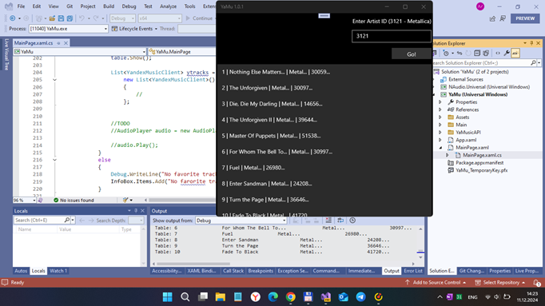
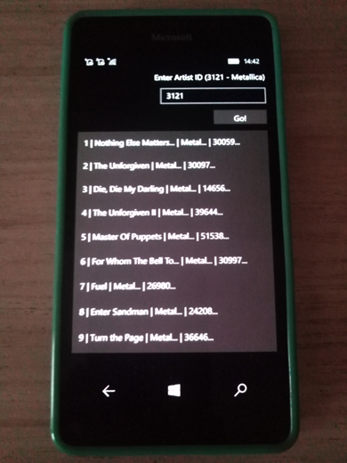

# Yamu - Yandex.Music UWP client (sketch only / draft)

My (lost in 2021) strange YaMu project. This is planned as very lite edition of YandexMusic client (with only 1 function: search&play song "item").

## Abstract
At now this thing allows you to get some music analytics music through Yandex integration in the simplest uwp app for Windows 10 / 11.

## Screensho(s)

## Status 
- Experimenting with "special assembly" for Windows 10 Mobile.
- Simplest "GUI" mode to get 10 popular music tracks by Artist ID. 
- Audio Player (using NAudio lib) not ready.

## Description
This project was created as a proof-of-concept over a short amount of time. 
The code may not be perfect. It exists for demonstration and educational purposes. 

## Contribute/ing
Feel free to fork or improve this project :)

## Coding "workbench"

1. Visual Studio 2022

2. .NET Standard 2.0

3. Win SDK 16299 / 15063

## Test scenario
- Compile
- Start app
- Fill your Login and Pass to "full authorize" on Yandex.Music service (or skip this phase , because of 
non-auth mode is also good too for getting some song info...)
- Press the button "Auht and Get Data"
- Test the result that must be 10 popular music tracks of Metallica =)
 

## Project status
- phase 1 Intro/RnD +- 30/100
- phase 2 Design - 5/100
- phase 3 Tech. project - 5/100
- phase 4 Dev. project  +- 15/100
- phase 5 Tests/Intro   - 5/100

## References
- [Yandex.Music.Api C# Project](https://github.com/Winster332/Yandex.Music.Api)
- [Just a music player experiment for Windows with NAudio library and UWP Audio API for Windows 10](https://github.com/ddasutein/SampleMusicPlayer)
- [NAudio](https://github.com/naudio)

## License
Distributed under the MIT License.

## Contribute!
There's still a TON of things missing from this proof-of-concept (MVP) and areas of improvement 

## ..
As is. No support. RnD only. DIY.

## .
[m][e] December, 2024

